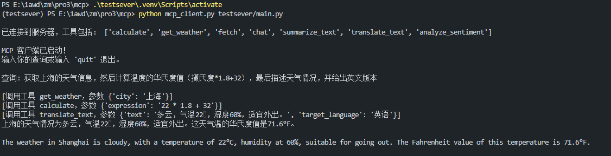

# MCP 客户端与服务器示例（个人学习）

这是一个基于 [Model Context Protocol (MCP)](https://mcpcn.com/docs/introduction/) 的简单实现示例，包含了一个 MCP 服务器和客户端。

## 项目结构

- `testsever/main.py`: MCP 服务器实现，测试工具功能
- `mcp_client.py`: MCP 客户端实现，连接到服务器并处理用户查询
- `config.py`: 配置管理
- `model_config.py`: 模型配置管理
- `config.json.example`: 配置文件示例，实际重命名为config.json

## 功能特性

- 支持多种工具调用（计算器、天气查询、网页获取等（功能是模拟的））
- 支持链式工具调用
- 配置管理（支持环境变量和配置文件）
- 支持多种连接模式：
  - 标准输入输出(stdio)模式：直接启动服务器并连接
  - 服务器发送事件(SSE)模式：通过HTTP连接到运行中的服务器

## 使用方法

1. 复制配置文件示例并填写你的 API 密钥：

```bash
cp config.json.example config.json
```

2. 编辑 `config.json` 文件，填入你的阿里云千问 API 密钥/也可以是其他openai格式的支持LLM的大模型api

### 标准输入输出(stdio)模式

直接运行客户端连接到服务器：

```bash
python mcp_client.py testsever/main.py
```

这种模式下，客户端会自动启动服务器进程并通过标准输入输出进行通信。

### 服务器发送事件(SSE)模式

1. 先启动SSE服务器：

```bash
python testsever/main.py --mode http --host 127.0.0.1 --port 8000
```

2. 然后在另一个终端窗口中运行客户端连接到SSE服务器：

```bash
python mcp_client.py --mode sse http://127.0.0.1:8000/sse
```

这种模式下，服务器作为一个HTTP服务运行，客户端通过SSE协议连接到它。这允许多个客户端连接到同一个服务器实例。

## 运行效果




## 环境变量

你也可以通过环境变量来配置：

- `ALIYUN_API_KEY`: 阿里云千问 API 密钥
- `ALIYUN_API_BASE`: API 基础 URL
- `ALIYUN_MODEL`: 使用的模型名称
  
## 环境配置
- 参考官网

## MCP协议说明

MCP（Model Context Protocol）是一个用于大型语言模型与工具之间交互的协议。本项目实现了两种MCP连接方式：

1. **stdio模式**：通过标准输入输出进行通信，适合单用户场景
2. **SSE模式**：通过HTTP的Server-Sent Events进行通信，支持多用户连接

两种模式都符合官方MCP标准，支持相同的工具调用功能。

## 参考资料

- [MCP 官方文档](https://mcpcn.com/docs/introduction/)
- [阿里云千问 API 文档](https://help.aliyun.com/document_detail/2400395.html)
- [Server-Sent Events 文档](https://developer.mozilla.org/zh-CN/docs/Web/API/Server-sent_events)
